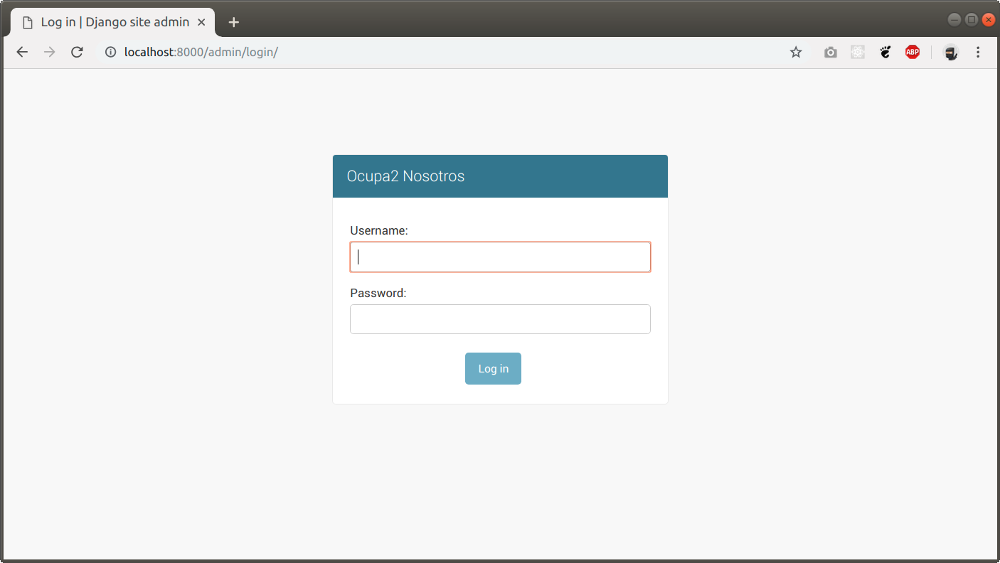
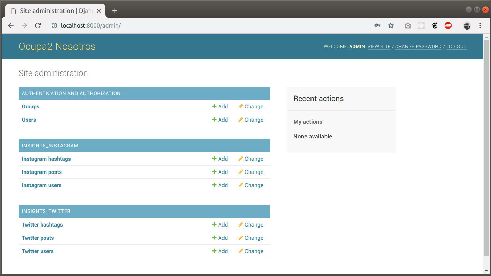
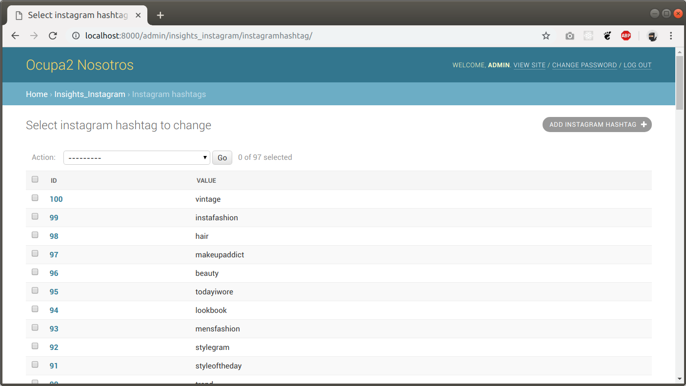
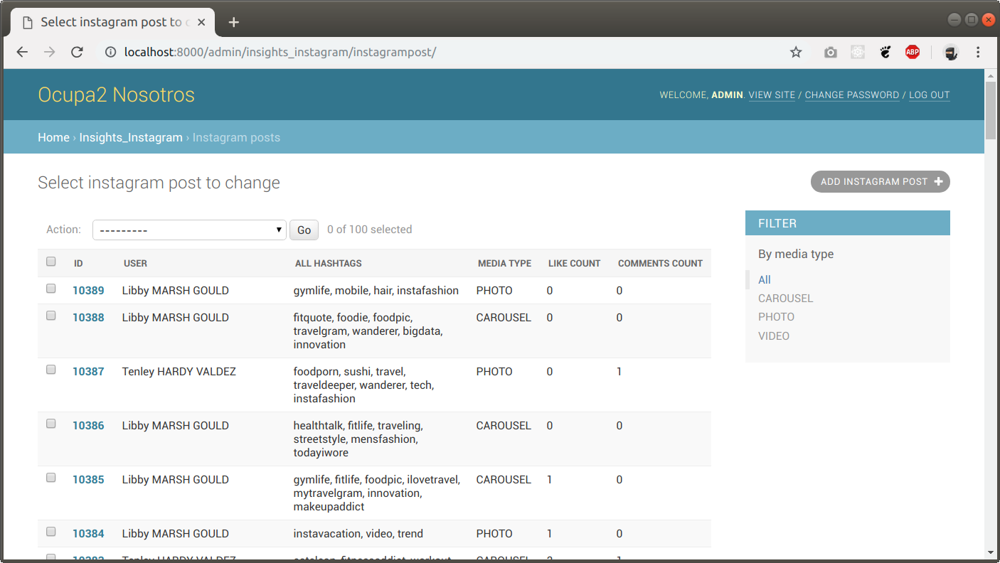
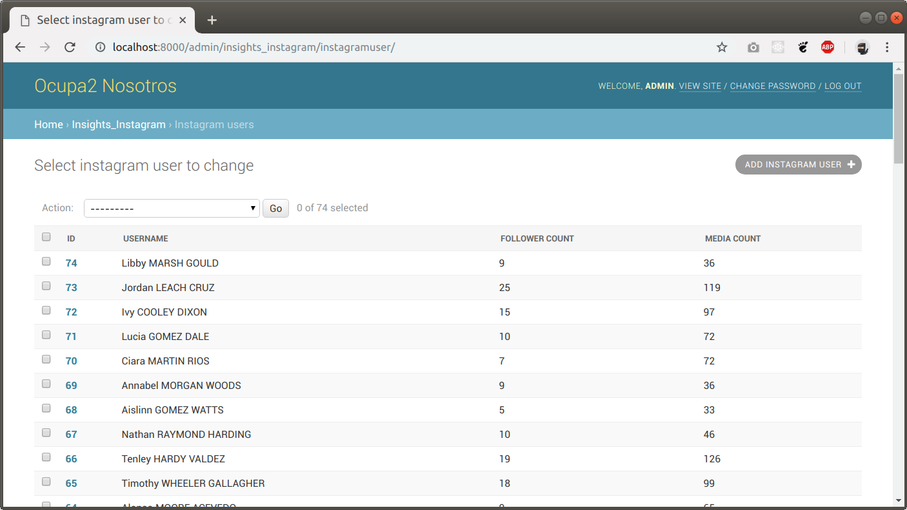
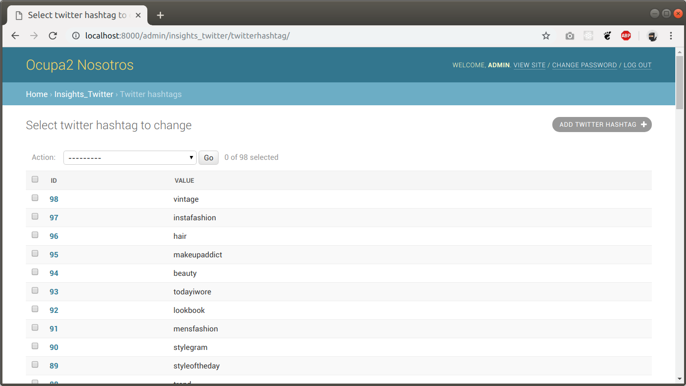
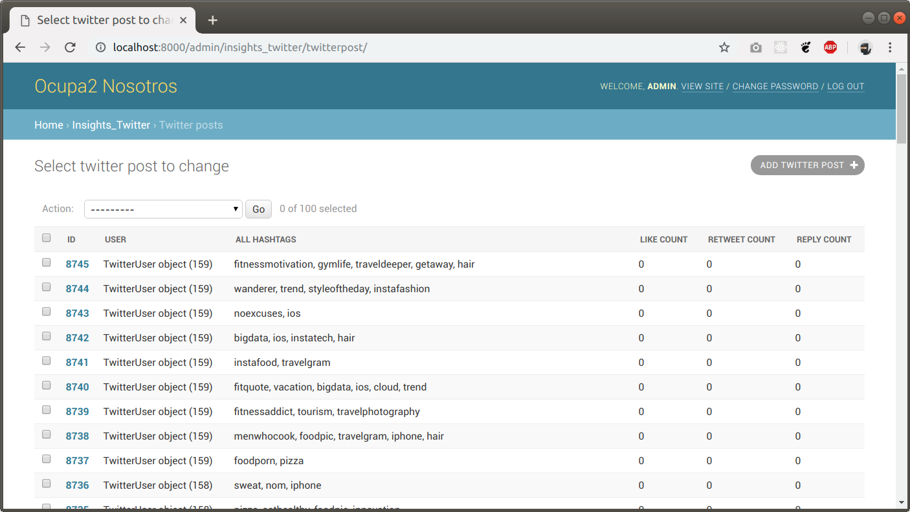
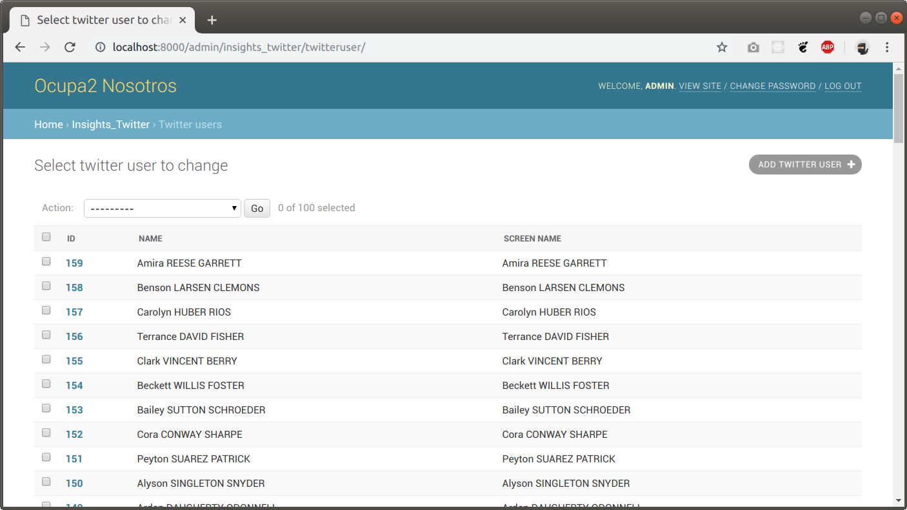

# Reto redes sociales (insight)

Esta aplicación implementa la funcionalidad necesaria para interactuar con las redes sociales de Instagram y Twitter de
acuerdo a como se solicitaba en el resto. Esto supone haber implementado las llamadas a la API por partida doble: aquí
y también en la aplicación frontend serverless.

Accesible desde http://ocupa2.javiermatos.com (en el panel del frontend tenemos los enlaces). En concreto, los enlaces
son http://ocupa2.javiermatos.com/admin/ para el backend y http://ocupa2.javiermatos.com/grafana/ para la instalación
de Grafana que muestra los gráficos de forma conveniente.


## Sobre el stack tecnológico

Para implementar la lógica hemos optado por utilizar el lenguaje de programación Python y el framework Django. El
resultado es una aplicación capaz de interactuar con las redes y descargar la información necesaria para realizar los
análisis. Los datos acumulados por parte del proyecto Django son mostrados dentro de Grafana a través de dashboards.


## ¿Qué se ha hecho?

Se han implementado modelos para almacenar la información de las redes sociales. Esta información se almacena en una
base de datos que es consumida por un sistema de visualización como es Grafana. El dashboard creado está accesible
desde la página que se ha lanzado a producción para mostrar el proyecto en funcionamiento.


## La página admin de Django


















## Scripts para importación de datos

La aplicación está acompañada de unos scripts implementados en Django que pueden ser llamados desde consola y que se
utilizan para importar la información desde las apis de las redes sociales.

Para importar los datos de Instagram hay que ejecutar lo siguiente:

```
python manage.py instagram_import_hashtags
python manage.py instagram_import_posts_users
```

Para importar los datos de Twitter hay que ejecutar lo siguiente:

```
python manage.py twitter_import_hashtags
python manage.py twitter_import_posts_users
```

Estos scripts utilizan barras de progreso para hacer más visible el progreso en la importación de datos.


### La base matemática y las limitaciones de las apis

Se nos comentó que la api tiene una limitación en el número de requests. Esto es habitual y el sistema de quotas que
implementan tiene que ser tenido en cuenta de cara a las soluciones propuestas.

Para el caso de Instagram es posible hacer una ordenación de los posts de acuerdo a los más *top* así que ese puede ser
un buen comienzo. Como nosotros en nuestro caso no contamos con datos reales hemos de valernos de los indicadores tales
como el número de contactos en las redes y el impacto mediante likes, retweets y comentarios.

La forma en que hemos considerado a los usuarios más influyentes es mediante una fórmla ponderada que suma todos los
factores que consideramos hay que tener en cuenta.


### Notas

Este proyecto ha sido realizado por Javier Matos para presentar al Hackathon de Ocupa2.
